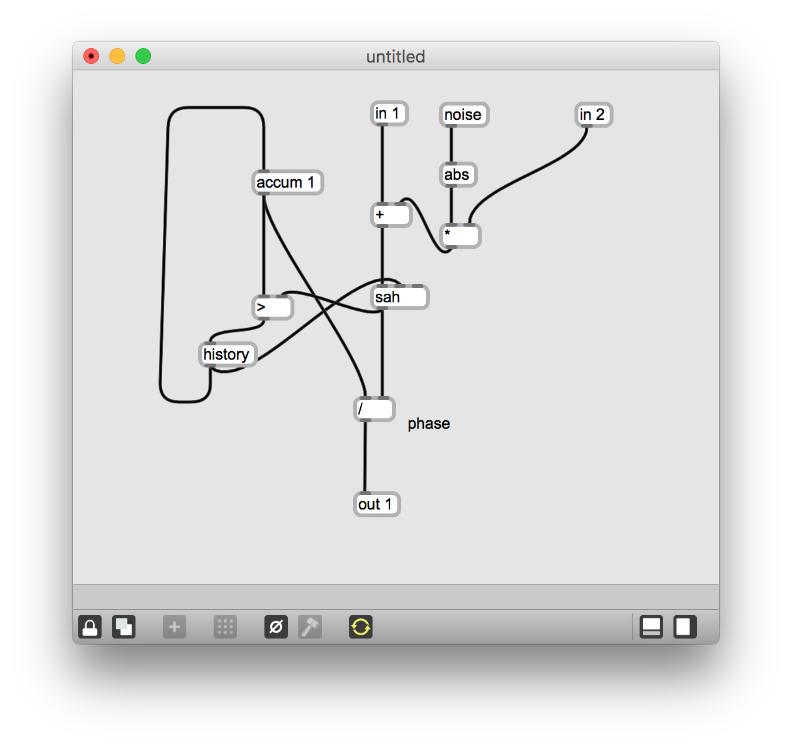
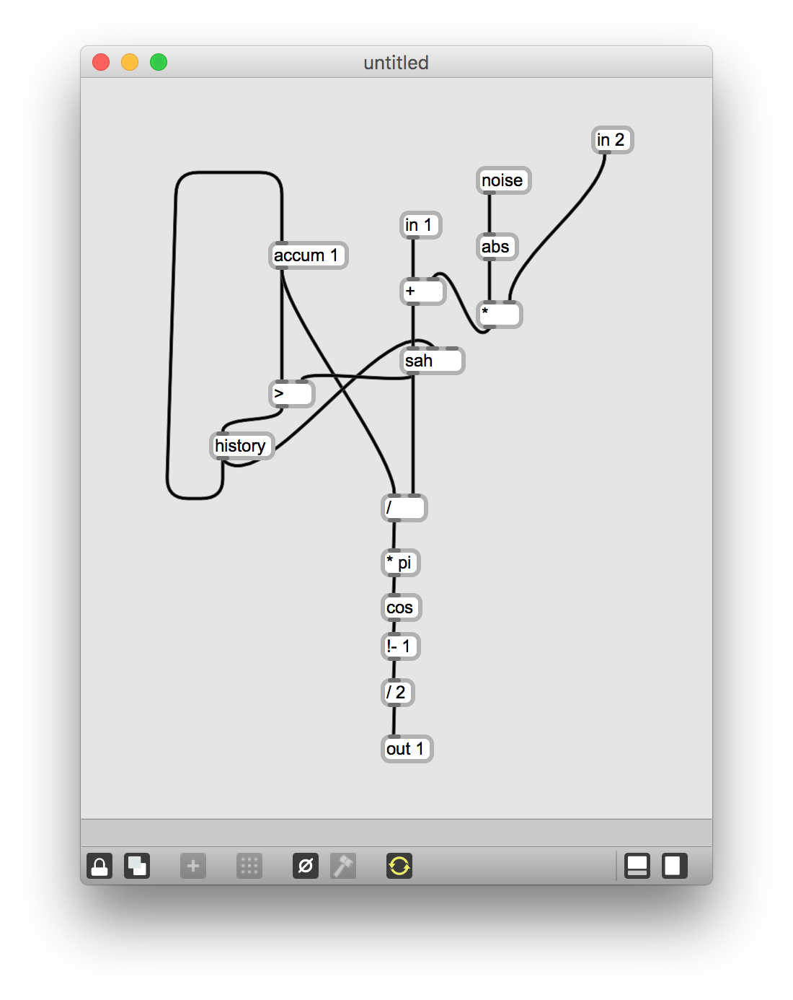
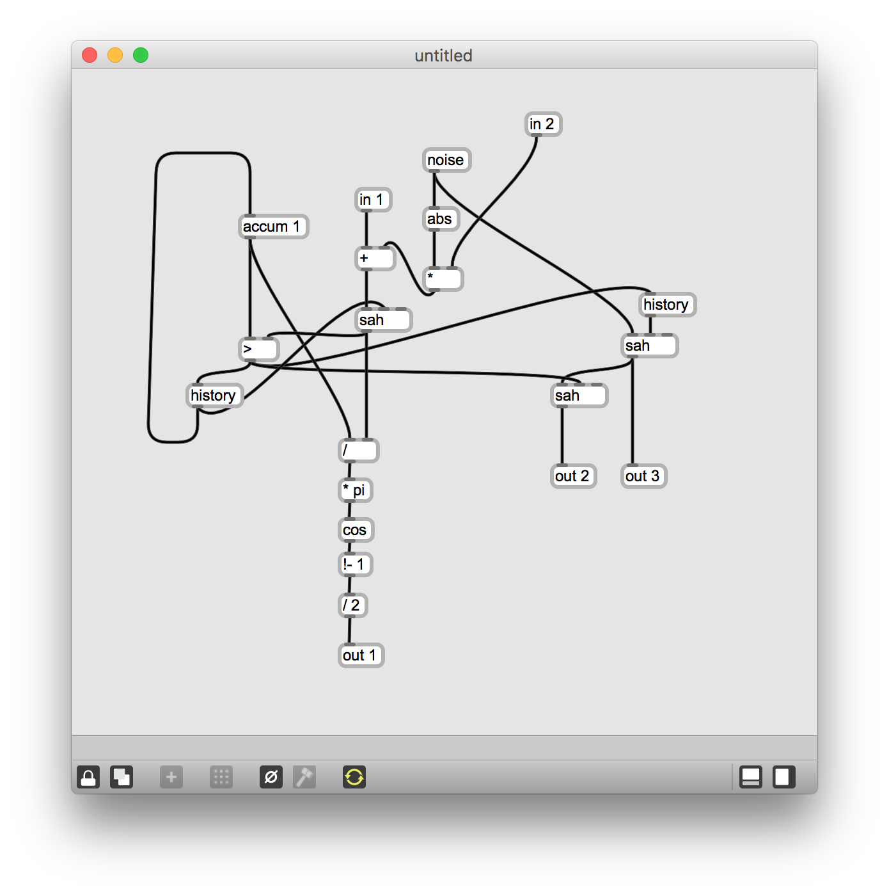
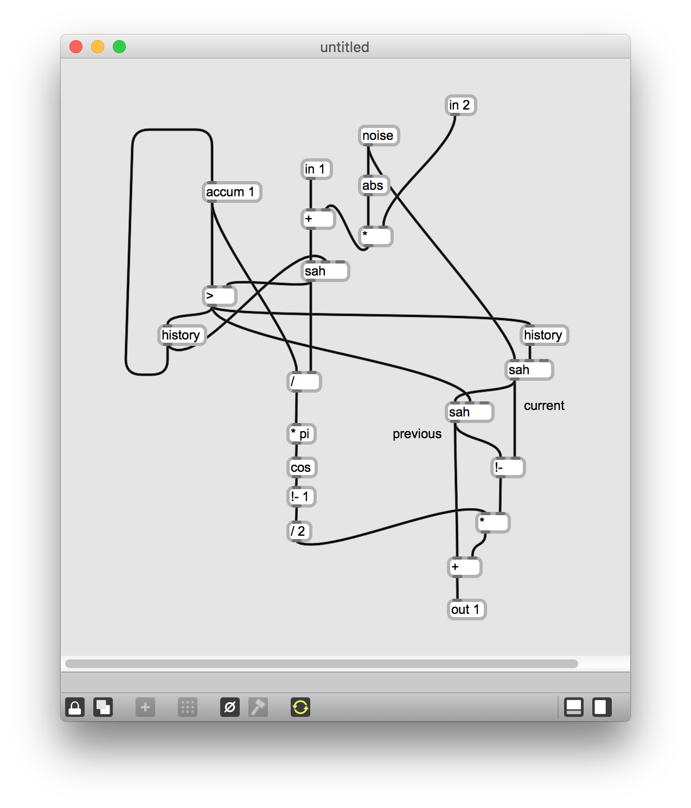
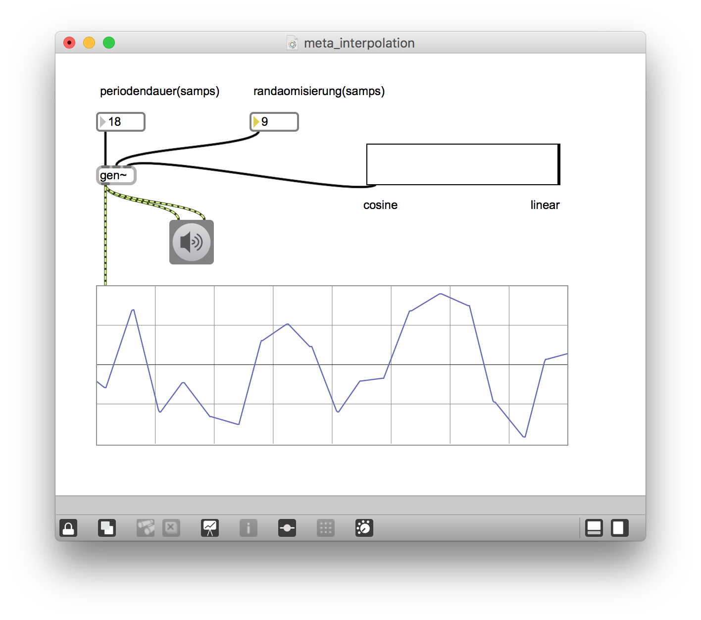
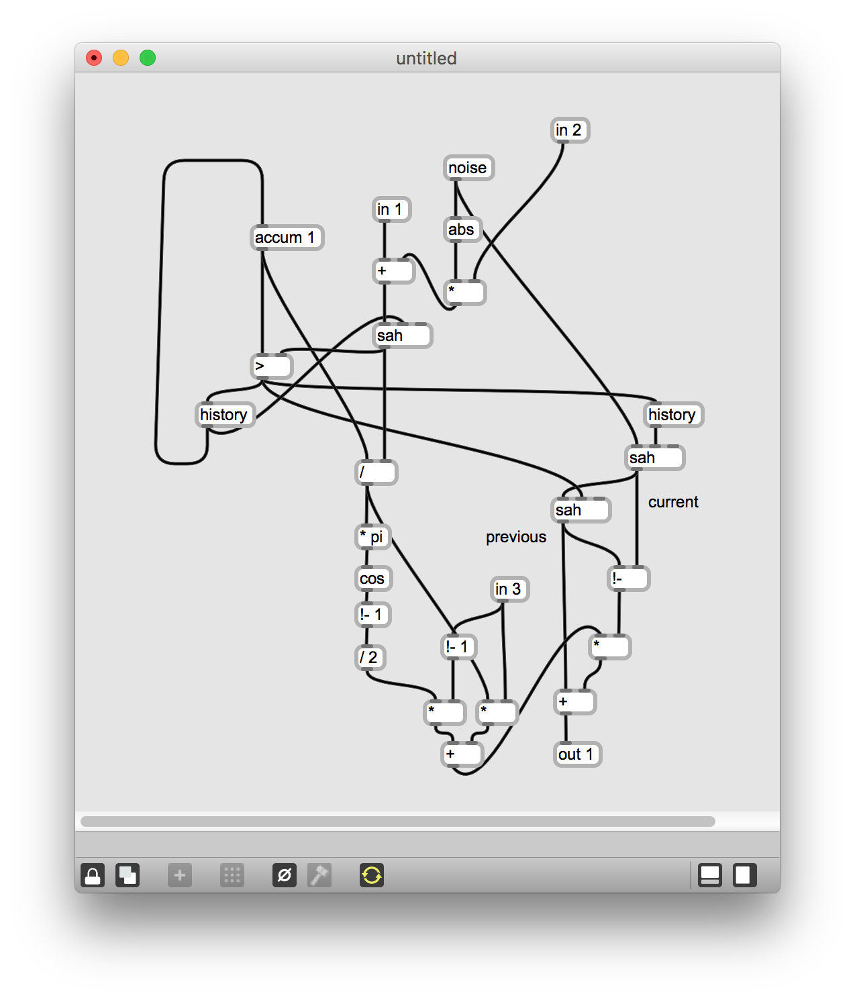
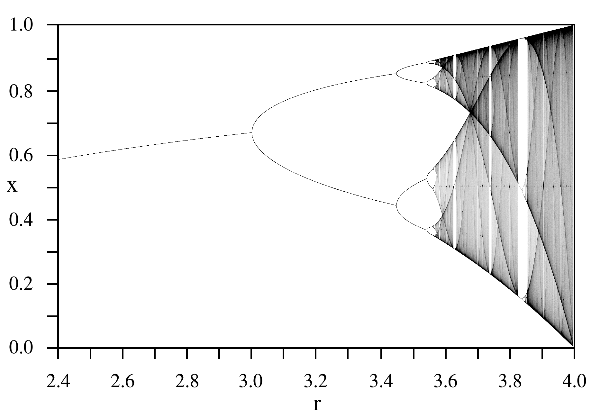
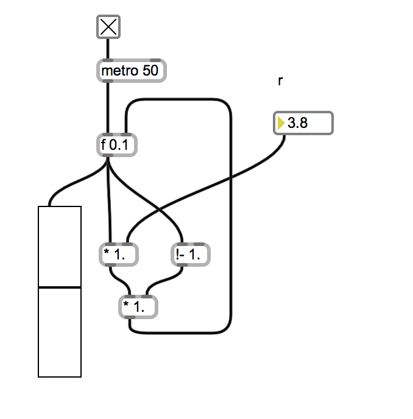
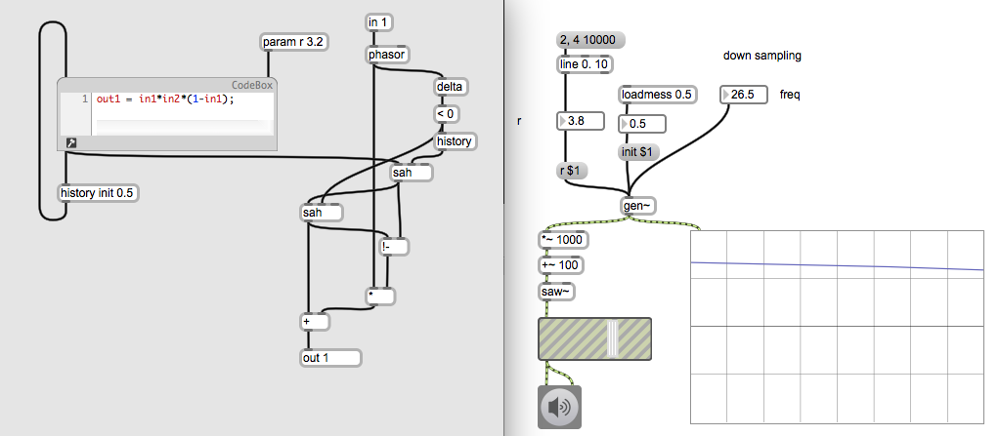
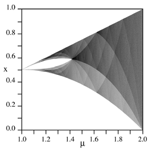

# Klasse8

## von Randomisierung nach Chaos

### Aufgabe / Lösungsschlüssel

### Main Patch
 

---
### Unregelmäßige Sägezahn

---
### Unregelmäßige Sägezahn + Cosine-Interpolation

---
### der jetzige und letzte Wert

---
### Randomisierung + Cosine-Interpolation

---
### Anwendung A

---
### Anwendung B

---
### Interpolation der Interpolation

Linear und Consine Interplation interpolieren!

---

### Das Chaos

[Chaosforschung](https://de.wikipedia.org/wiki/Chaosforschung)

Die Chaosforschung oder Chaostheorie bezeichnet ein nicht klar umgrenztes Teilgebiet der Nichtlinearen Dynamik bzw. der Dynamischen Systeme, welches der Mathematischen Physik oder angewandten Mathematik zugeordnet ist. Im Wesentlichen beschäftigt sie sich mit Ordnungen in speziellen dynamischen Systemen, deren zeitliche Entwicklung unvorhersagbar erscheint, obwohl die zugrundeliegenden Gleichungen deterministisch sind. Dieses Verhalten wird als deterministisches Chaos bezeichnet und entsteht, wenn Systeme empfindlich von den Anfangsbedingungen abhängen: Ganz leicht verschiedene Wiederholungen eines Experimentes können im Langzeitverhalten zu höchst unterschiedlichen Messergebnissen führen (die Chaostheorie besagt also nicht, dass identische Anfangsbedingungen zu verschiedenen Ergebnissen führen würden). 

### Logistic Map

### Max Implementation

### Gen Implementation

### Gen Implementation + Downsampling

### Gen Implementation + Downsampling + Interpolation

[List of Map](https://en.wikipedia.org/wiki/List_of_chaotic_maps)

[Chikashi's Pd-externals für Chaos](https://github.com/chikashimiyama/pd_externals)

### Aufgabe
Programmieren Sie einen Strange-Attaktor, der tent-map verwirklicht. 

- Die Frequenz der Ausgaben muss einstellbar sein.
- mit Cosine-Interpolation
- bietet einen Parameter für unregelmäßige Ausgabe an

### TentMap
[Zeltabbildung](https://de.wikipedia.org/wiki/Zeltabbildung)

